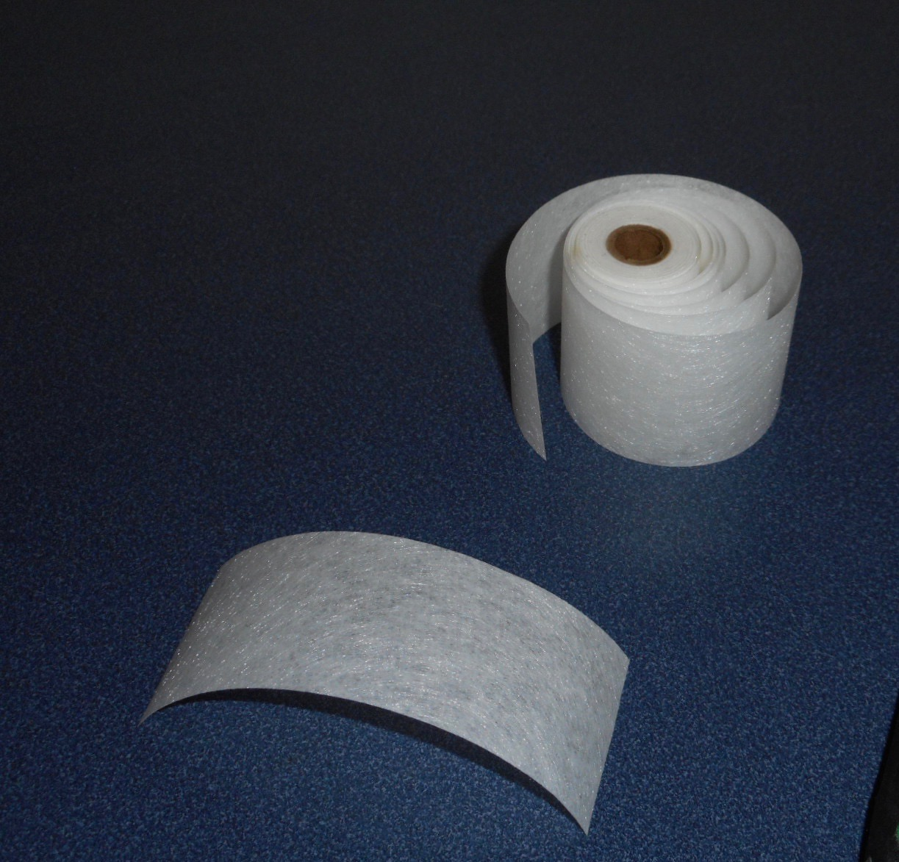
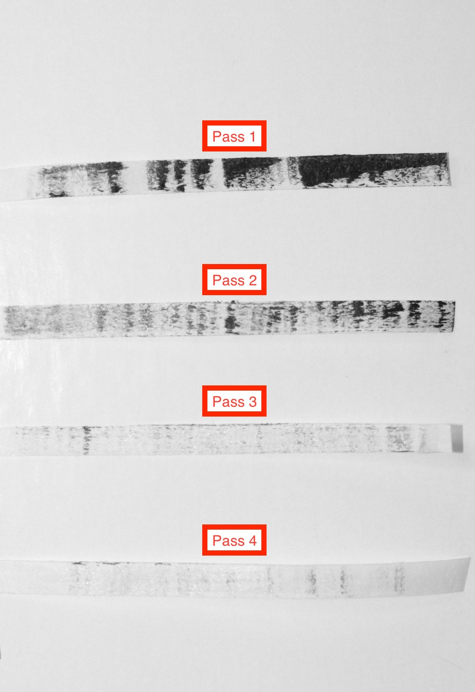
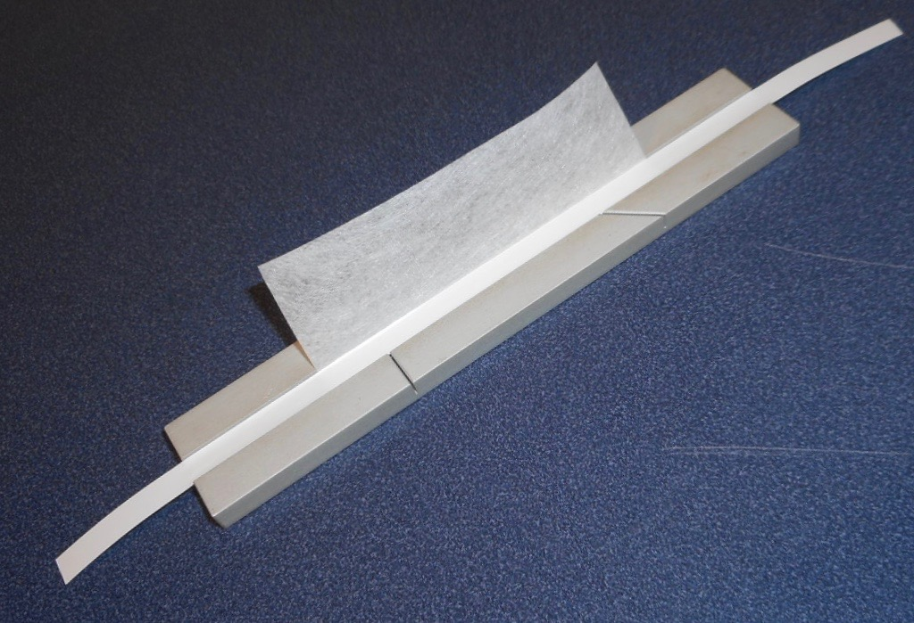
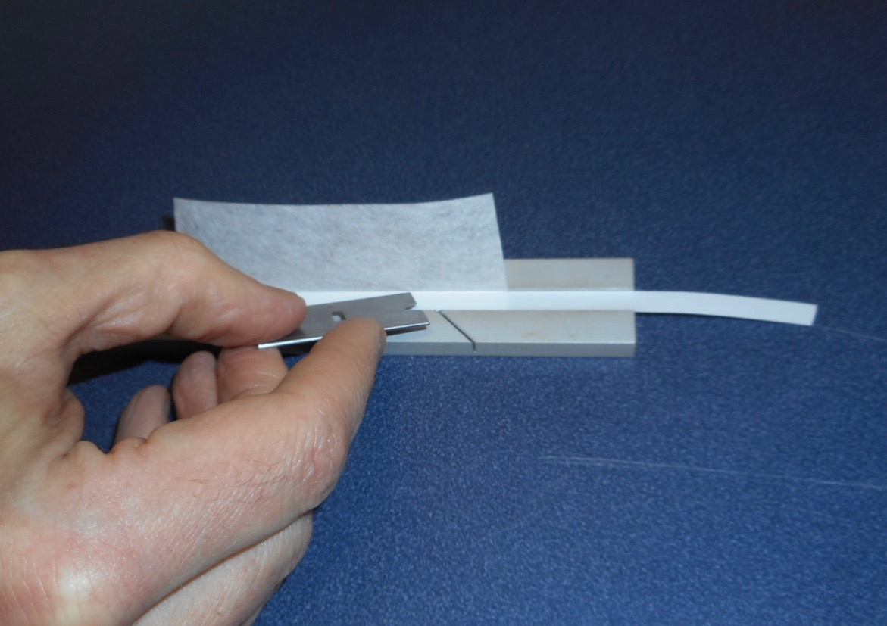
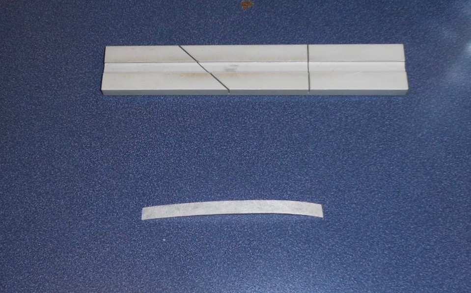
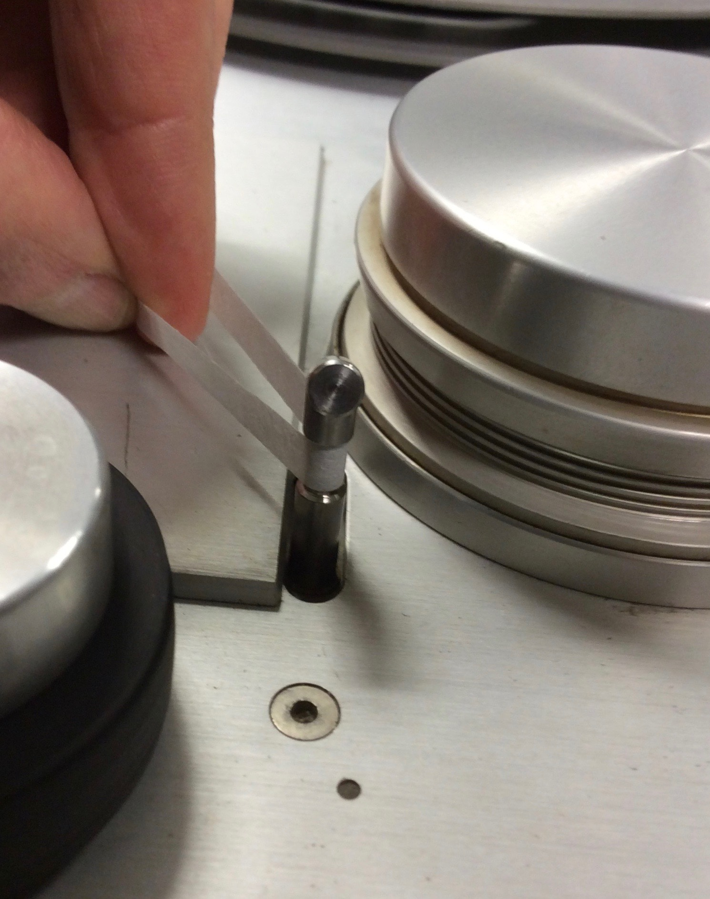
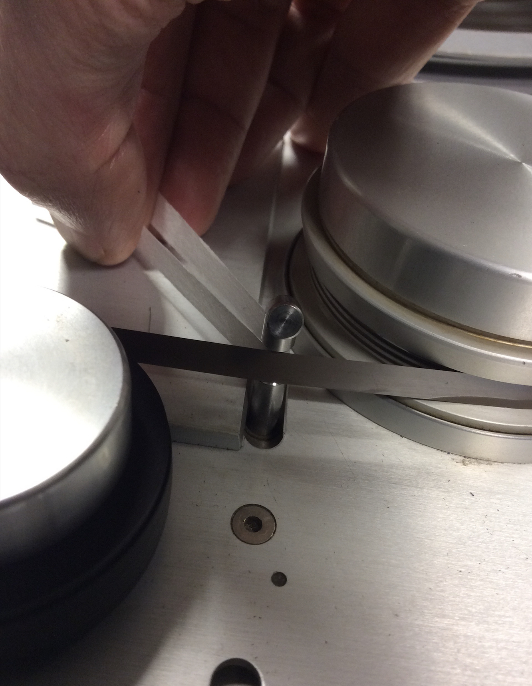
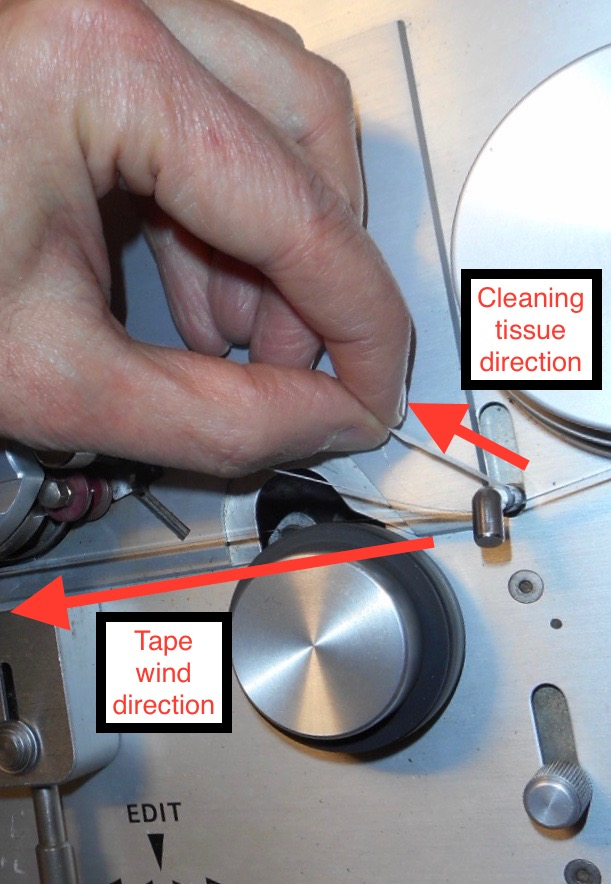
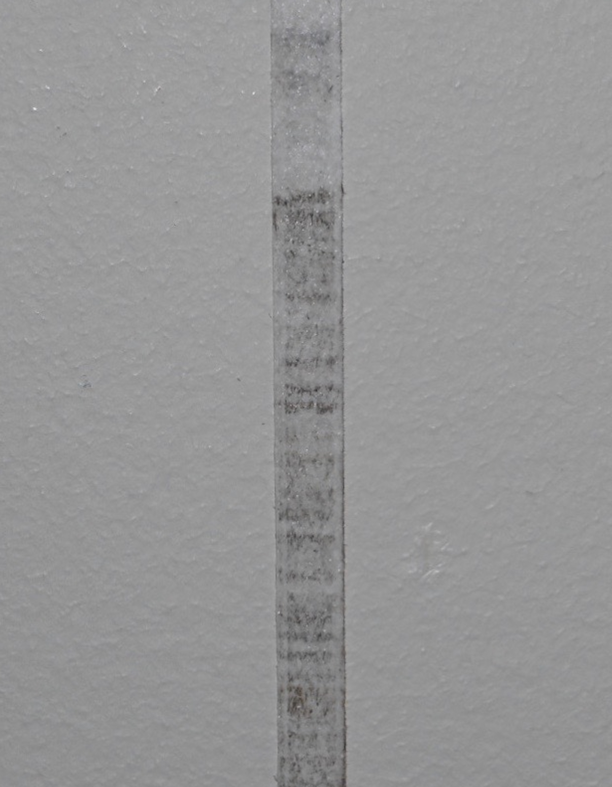

# Workflow for the surface cleaning of the emulsion layer of audio tape.

## Overview

The following is a workflow for the surface cleaning of audio tape. It is mechanical process that may reduce debris (tape shedding and other particulate matter) found on the emulsion layer of the medium which, left untreated, may lead to sqeeking, signal loss and speed irregularities. 

The deck used in this workflow description is the Studer A80 RC.    

  
## Workflow
   
1)  Cut a 3 to 4-inch piece of RTI cleaning tissue, or comparable non-woven cleaning fabric.  

*Example: RTI cleaning tissue*  

      

2)  Put the cleaning tissue in an audio tape splicing block.  Score and crease the excess tissue, using the block as a guide.  
   
    

*Example: cleaning tissue creased and scored into a splicing block*  
  
  
3)  Lay a piece of leader tape on top of the tissue in the block.   Work the leader tape and tissue down into the block to secure both into place.  
 
      
*Example: leader tape securing the cleaning tissue in place*  
 

      
4)  With a straight-edge razor, cut the tissue down to size in the block
  
      
*Example: cleaning tissue being cut to size*  
.  

      
*Example: cleaning tissue cut to a 1/4-inch width* 
.  

      
5)  Load the tape to be cleaned onto the take-up side of the Studer A80.  Set up he tape to be wound onto an empty reel on the supply side of the deck.  Loop the trimmed cleaning tissue onto the notch of the Edit Lifter of the Studer A80.  

      
*Example: cleaning tissue being placed on the Edit Lifter*  
.  

6)  Move the Edit Lifter forward to put the cleaning tissue in contact with the emulsion layer of the audio tape which was loaded on to the deck.  
  
      
*Example: the Edit lifter moved forward to place the tissue in contact with the audio tape*  

      
7)  Simultaniously, wind the audio tape onto the supply side reel, and --in the opposite direction of the winding audio tape -- slowly pull the the cleaning tissue forward.

      
*Example: audio tape and cleaning tissue moving in opposite directions*  
  

      
8)  Repeat as needed.  One pass, however, is normaly sufficient.  

      
*Example: cleaning tissue with debris lifted from the emulsion layer of the audio tape*  

